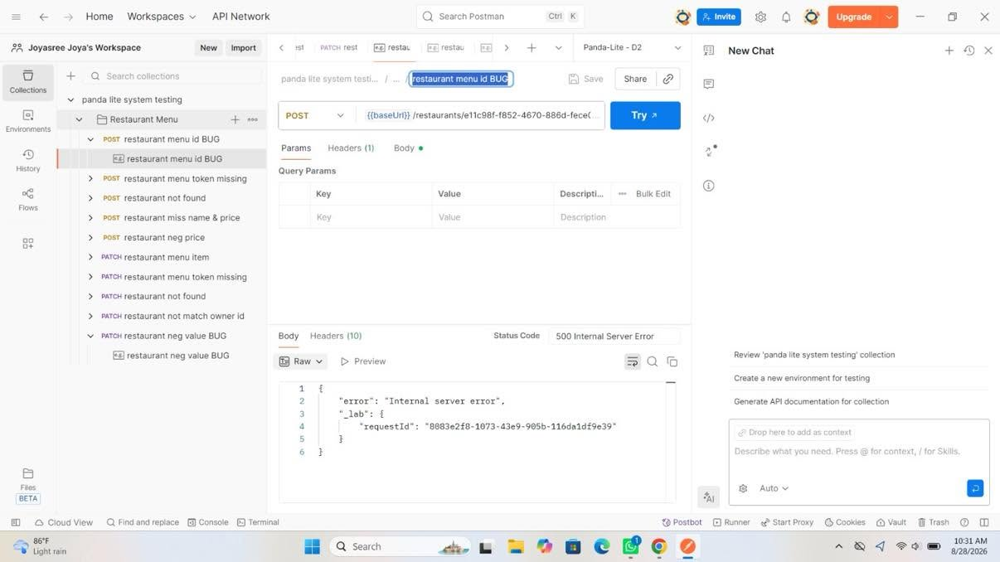
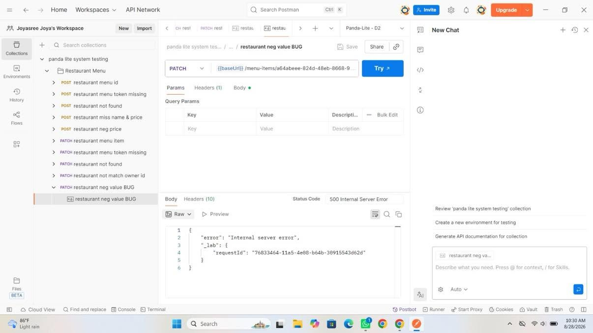

# Panda-Lite API System Testing Report

**Course:** [Software Testing]

**Assignment:** System Testing

**Group:** [Team D2]

**Submission Date:** [8/27/2026]

# 1. Team Plan

## 1.1 Team Members

| No. | Student Name | Student ID | Responsibility |
|---|---|---|---|
| 1 | Mania Sultana | 011212038 | Authentications,Restaruants, Orders  |
| 2 | Taspia Akter Epou| 011212163 | Orders, Rating |
| 3 | Sumaiya Islam Ety | 011212164 | Orders-Claim |
| 4 | Joysree Bardhan | 011221189 | Restaruants-menu-item ,Id |

## 1.2 Individual Contribution

**Name:** Mania Sultana

**Student ID:** 011212038

**Assigned Module:** Rating API

### My Responsibilities

- Tested the Rating API endpoints using Postman.
- Created positive and negative test cases for restaurant ratings.
- Validated HTTP status codes, response structure, fields, and query parameters.
- Identified and documented API defects with screenshots and test evidence.

# 2. Testing Scope

The Panda-Lite API was tested using Postman.

The testing covered:

- Authentication
- Restaurants
- Orders
- Ratings

The testing included:

- Positive test cases
- Negative test cases
- Status code validation
- Response body validation
- Required field validation
- Query parameter validation
- Error response validation
- Postman test scripts

# 3. Test Environment

| Item | Details |
|---|---|
| Testing Tool | Postman |
| Application | Panda-Lite API |
| Environment | Panda-Lite - D2 |
| API Type | REST API |
| Authentication | Bearer Token |
| Headers | Personal key |

# 4. Test Cases

## 4.1 Test Case Summary

| Test Case ID | Test Case | Endpoint | Expected Status | Actual Status | Verdict |
|---|---|---|---:|---:|---|
|606d45 | Register new user | POST/{{baseUrl}}/auth/register | 200 | 200 | PASS|
|a34a7d | Register User Already Exists | POST/{{baseUrl}}/auth/register | 409 | 409  | PASS|
|35f18b | Register User type |  POST/{{baseUrl}}/auth/register | 400 | 400 | PASS |
|3dad9f | Register User role remove |  POST/{{baseUrl}}/auth/register | 400 | 400 | PASS |
|8fdec1 | Register User password short |  POST/{{baseUrl}}/auth/register | 400 | 400 | PASS |
|78bc4d | Login User | Post/{{baseUrl}}/auth/login  | 200 | 200| PASS |
|44d8d8 | Login User wrong pass | Post/{{baseUrl}}/auth/login | 401 | 401 | PASS/Fail |
|f90a8d | Login User not exist |  Post/{{baseUrl}}/auth/login | 401 | 401 | PASS/Fail |
|e98500 | Login User Missing Credentials|  Post/{{baseUrl}}/auth/login  | 400 | 400 | PASS/Fail |
|aed6dc | Get all Restaruants| GET/{{baseUrl}}/restaurants  | 200| 200 | PASS|
|7eb0d7 | Create Restaruants | POST/{{baseUrl}}/restaurants  | 201| 201 | PASS|
|b3e003 | Get all Restaruants ID | GET/{{baseUrl}}/restaurants  | 200| 200 | PASS|
| f9fdde| Get all Restaruants ID No token | GET/{{baseUrl}}/restaurants/e1c1c98f-f852-4670-886d-fece05da2099  | 401| 401 | PASS|
|3338b0 | Get all Restaruants ID No Found | GET/{{baseUrl}}/restaurants/00000000-0000-0000-0000-000000000000 | 404| 404 | PASS|
|401cc2 | Get all Restaruants Open status | PATCH/{{baseUrl}}/restaurants/e1c1c98f-f852-4670-886d-fece05da2099 | 201| 201| PASS|
|18eb4b | Get all Restaruants menu Item | POST/{{baseUrl}}/restaurants/e1c1c98f-f852-4670-886d-fece05da2099/menu | 201| 201| PASS| 
|c6da00 | Restaruants ID Missing Token | PATCH/{{baseUrl}}/restaurants/e1c1c98f-f852-4670-886d-fece05da2099 | 401| 401| PASS|
|210d4a | Restaruants ID Not Found  | Patch/{{baseUrl}}/restaurants/00000000-0000-0000-0000-000000000000 | 404| 404| PASS|
|157f11 | Restaurants  Bug restaurants name any can  set | PATCH/{{baseUrl}}/restaurants/e1c1c98f-f852-4670-886d-fece05da2099 | 200| 200| PASS|
|a08d9d |No Token |Get/{{baseUrl}}/restaurants | 401| 401| PASS|
|e6e59c |Invaild Query Params |{{baseUrl}}/restaurants?sort_by=wrong| 400| 400 | PASS|
|220b52 |Restaurants Order Status | PATCH/{{baseUrl}}/orders/c3969e61-5e30-4bb9-a711-6e586ee00c7b/status | 200| 200| PASS|
|6e5164 |Restaurants Order Status missing Token | PATCH/{{baseUrl}}/orders/c3969e61-5e30-4bb9-a711-6e586ee00c7b/status | 401| 401| PASS|
|6faba  |Restaurants Order Status invaild check| PATCH/{{baseUrl}}/orders/c3969e61-5e30-4bb9-a711-6e586ee00c7b/status | 404| 404| PASS|
|1a7a1c |Order Status required | PATCH/{{baseUrl}}/orders/c3969e61-5e30-4bb9-a711-6e586ee00c7b/status | 400| 400| PASS|
|1f1a83 |Order Status preparing | PATCH/{{baseUrl}}/orders/c3969e61-5e30-4bb9-a711-6e586ee00c7b/status | 400| 400| PASS|
|eebb7b |Order Status ready for pickup | PATCH/{{baseUrl}}/orders/c3969e61-5e30-4bb9-a711-6e586ee00c7b/status | 200| 200| PASS|
|0801f7 |Order Status ready for picked_up | PATCH/{{baseUrl}}/orders/c3969e61-5e30-4bb9-a711-6e586ee00c7b/status | 200| 200| PASS|
|415fc2 |Order Status delivered| PATCH/{{baseUrl}}/orders/c3969e61-5e30-4bb9-a711-6e586ee00c7b/status | 200| 200| PASS|
|1c1be1|Order cancelled| PATCH/ {{baseUrl}}/orders/db8a65cc-f179-44a4-ae94-12a7eb94ca9b/cancel | 200| 200| PASS|
|08ac72e|Order cancelled missing token | PATCH/ {{baseUrl}}/orders/db8a65cc-f179-44a4-ae94-12a7eb94ca9b/cancel | 401| 401| PASS|
|685c77 |Order cancelled Not found  | PATCH/ {{baseUrl}}/orders/db8a65cc-f179-44a4-ae94-12a7eb94ca9b/cancel | 404| 404| PASS|
|230388 |Order cancelled fee include bug  | PATCH/ {{baseUrl}}/orders/db8a65cc-f179-44a4-ae94-12a7eb94ca9b/cancel | 404| 404| PASS/Fail|
|b4d2b2 |Order rating  only Owner  | PATCH/ {{baseUrl}}/orders/db8a65cc-f179-44a4-ae94-12a7eb94ca9b/rate| 403| 403| PASS|
|650a7c |Order  only claim rider  | PATCH/ {{baseUrl}}/orders/c3969e61-5e30-4bb9-a711-6e586ee00c7b/claim | 200| 200| PASS|
| f39183| Oder customer rating | post/{{baseUrl}}/orders/c3969e61-5e30-4bb9-a711-6e586ee00c7b/rate| 201| 201| PASS|
|80121b | restaruant customer rating check | GEt/{{baseUrl}}/orders/c3969e61-5e30-4bb9-a711-6e586ee00c7b/rate| 200| 200| PASS|
|d1a2ce | restaruant customer rating check  sort by ASC | GEt/{{baseUrl}}/orders/c3969e61-5e30-4bb9-a711-6e586ee00c7b/rate| 200| 200| PASS|
|e07de0 | restaruant customer rating check  sort by DESC&  value | GEt/{{baseUrl}}/orders/c3969e61-5e30-4bb9-a711-6e586ee00c7b/rate| 200| 200| PASS|
|b367cf | restaruant customer rating check  sort by DESC&   wrong value | GEt/{{baseUrl}}/orders/c3969e61-5e30-4bb9-a711-6e586ee00c7b/rate| 400| 400| PASS|
|32bf3d | newCustomer reg | POST/{{baseUrl}}/auth/register | 200 | 200 | PASS|
|a23188 | order valid | POST/{{baseUrl}}/orders | 201 | 201 | PASS|
|29b044 | Get all orders | GET/{{baseUrl}}/orders | 200 | 200 | PASS|
|4e663b | single order | GET/{{baseUrl}}/orders/50223eb1-bb33-49ad-87b8-4be3b58ad897| 200 | 200 | PASS|
|4e663b | orderId Timeline | GET/{{baseUrl}}/orders/50223eb1-bb33-49ad-87b8-4be3b58ad897/timeline| 200 | 200 | PASS|
|76f9a8 | invalidFilter timeline | GET/{{baseUrl}}/orders/50223eb1-bb33-49ad-87b8-4be3b58ad897/timeline/?filter_field=status| 400 | 400 | PASS|
|9a741c | orderId NotFound | GET/{{baseUrl}}/orders/50223eb1-bb33-49ad-87b8-4be3b58ad898/timeline| 404 | 404 | PASS|
|2b359f | Timeline missingToken | GET/{{baseUrl}}/orders/50223eb1-bb33-49ad-87b8-4be3b58ad897/timeline | 401 | 401 | PASS|
|c52c00 |token missing | GET/{{baseUrl}}/orders/be89cdf4-d0ef-4fa0-8d16-53ef0f024cd5 | 401 | 401 | PASS|
|82d084 |error customerOrder | GET/{{baseUrl}}/orders/45304403-7e7b-482f-aef6-696c12c2c140 | 200 | 200 | PASS|
|e1c26c |order notFound | GET/{{baseUrl}}/orders/be89cdf4-d0ef-4fa0-8d16-53ef0f024cd6 | 404 | 404 | PASS|
|73f52b |invalid filterValue | GET/{{baseUrl}}/orders?filter_field=status| 400 | 400 | PASS|
|2caa32 |missingToken | GET/{{baseUrl}}/orders| 401 | 401 | PASS|
|e19055 |stock out | POST/{{baseUrl}}/orders| 400 | 400 | PASS|
|33a89d |restaurant notfound | POST/{{baseUrl}}/orders| 404 | 404 | PASS|
|4c19e4 |id and items | POST/{{baseUrl}}/orders| 400 | 400 | PASS|
|3ea1e4 |Non customer | POST/{{baseUrl}}/orders| 401 | 401 | PASS|
|ce7852 |ordertoken missing | POST/{{baseUrl}}/orders| 401 | 401 | PASS|
|9662f4 |restaurant open | PATCH/{{baseUrl}}/restaurants/e1c1c98f-f852-4670-886d-fece05da2099| 200 | 200 | PASS|
|5527b7 |customer rating | POST/{{baseUrl}}/orders/c3969e61-5e30-4bb9-a711-6e586ee00c7b/rate| 201 | 201 | PASS|
|5527b7 |already rated | POST/{{baseUrl}}/orders/c3969e61-5e30-4bb9-a711-6e586ee00c7b/rate| 201 | 201 | PASS|
|db4d88 |rating score | POST/{{baseUrl}}/orders/a729e739-b14e-4938-9043-2ee8895f447a/rate| 400 | 400 | PASS|
|a638e0 |only customer rating | POST/{{baseUrl}}/orders/c3969e61-5e30-4bb9-a711-6e586ee00c7b/rate| 403 | 403 | PASS|
|c0b04a |order notFound | POST/{{baseUrl}}/orders/c3969e61-5e30-4bb9-a711-6e586ee00c6b/rate| 404 | 404 | PASS|
|6366c2 |missing token | POST/{{baseUrl}}/orders/c3969e61-5e30-4bb9-a711-6e586ee00c7b/rate| 401 | 401 | PASS|
|df9e39 |restaurant menu id BUG | POST/{{baseUrl}}/restaurants/e11c98f-f852-4670-886d-fece05da2099/menu| 201 | 500 | FALL|
|f68e04 |restaurant menu token missing | POST/{{baseUrl}}/restaurants/e1c1c98f-f852-4670-886d-fece05da2099/menu| 401 | 401 | PASS|
|b783d9 |restaurant not found | POST/{{baseUrl}}/restaurants/e1c1c98f-f852-4670-886d-fece05da2090/menu| 404 | 404 | PASS|
|1146f8 |restaurant miss name & price | POST/{{baseUrl}}/restaurants/e1c1c98f-f852-4670-886d-fece05da2099/menu| 400 | 400 | PASS|
|5e43af |restaurant neg price | POST/{{baseUrl}}/restaurants/e1c1c98f-f852-4670-886d-fece05da2099/menu| 400 | 400 | PASS|
|ac8dc3 |restaurant menu item | PATCH/{{baseUrl}}/menu-items/a64abeee-824d-48eb-8668-9b7fe1a43c5e| 200 | 200 | PASS|
|600535 |restaurant menu token missing | PATCH/{{baseUrl}}/menu-items/a64abeee-824d-48eb-8668-9b7fe1a43c5e| 401 | 401 | PASS|
|d4bf85 |restaurant not found | PATCH/{{baseUrl}}/menu-items/a64abeee-824d-48eb-8668-9b7fe1a43c6e| 404 | 404 | PASS|
|48522c |restaurant not match owner id | PATCH/{{baseUrl}}/menu-items/a64abeee-824d-48eb-8668-9b7fe1a43c5e| 401 | 401 | PASS|
|43d62d |restaurant neg value BUG | PATCH/{{baseUrl}}/menu-items/a64abeee-824d-48eb-8668-9b7fe1a43c5e| 400 | 500 | FAIL |
|85c2ee |Register duplicate email with different capitalization | POST/{{baseUrl}}/auth/register | 409 | 409 | PASS |
| 157f11 | Restaurant name empty | PATCH/{{baseUrl}}/restaurants/e1c1c98f-f852-4670-886d-fece05da2099 | 409 | 200 | FAIL |

## 3. Bug List

### BUG-01 — Restaurant Menu ID Issue

**Test Case ID:** fd9e39

**Module:** Restaurant

**Endpoint:** PATCH /restaurants/:id/menu

**Expected Status:** 201

**Actual Status:** 500

**Verdict:** FAIL

**Description:**  
The API returns a 500 Internal Server Error when the restaurant menu ID scenario is tested, while the expected response is 201.

**Evidence:**

### BUG-02 — Restaurant Menu Invalid Negative Value

**Endpoint:** PATCH `{{baseUrl}}/menu-items/{menuItemId}`

**Expected Result:** The API should reject the invalid negative value with a proper 4xx validation error.

**Actual Result:** The API returned `500 Internal Server Error`.

**Verdict:** FAIL

**Evidence:**

